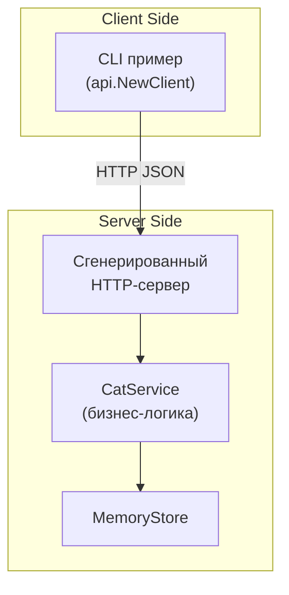

# 🐱 Cats Service — демонстрация использования Go + **ogen** в рамках тестового задания в MWS

> Мини-проект для знакомства с генератором Go-кода из OpenAPI-спецификаций 
**[ogen-go/ogen](https://github.com/ogen-go/ogen)**.  
> Сервис управляет сущностями `Cat` в памяти, имеет полностью сгенерированный слой HTTP-транспорт/клиент и покрыт
> модульными тестами.

---

## 📑 Содержание

- [О проекте](#о-проекте)
- [Исходный текст задания](#исходный-текст-задания)
- [Архитектура](#архитектура)
    - [Диаграмма компонентов](#диаграмма-компонентов)
- [API](#api)
- [Запуск](#запуск)
    - [Быстрый старт](#быстрый-старт)
    - [Makefile цели](#makefile-цели)
- [Тесты](#тесты)

---

## О проекте

Главная цель — показать, как сгенерировать **клиент** и **серверные хендлеры** из OpenAPI 3.0 при помощи `ogen`, а затем
реализовать свою бизнес логику и in-memory хранилище

Ключевые моменты реализации:

| Что                | Как реализовано                                                                                                                                                 |
|--------------------|-----------------------------------------------------------------------------------------------------------------------------------------------------------------|
| **OpenAPI**        | Yaml файл `openapi/openapi.yaml` описывает ресурсы `Cat`, `NewCat`, `UpdateCat` и CRUD-эндпоинты.                                                               |
| **Генерация**      | `make generate` вызывает `ogen` и помещает код в `internal/api`. В каждый сгенерированный метод пророс комментарий из OpenAPI `description` (см. задание ниже). |
| **Сервисный слой** | `internal/service` содержит логику `CatService`, разделяющую API и хранилище.                                                                                   |
| **Хранилище**      | `internal/store` — потокобезопасный `MemoryStore` (map + RWMutex)                                                                                               |
| **CLI-клиент**     | `cmd/client/main.go` — пример использования сгенерированного клиента.                                                                                           |
| **HTTP-сервер**    | `cmd/server/main.go` стартует сгенерированный `http.Handler`.                                                                                                   |
| **Тесты**          | `*_test.go` на store и service, демонстрируют CRUD сценарии.                                                                                                    |

---

## Исходный текст задания

<details>
<summary>Смотреть текст задания</summary>

Генерация golang кода с помощью ogen

**Задача:**  
Разобраться в генераторе golang кода по OpenAPI спецификации — Ogen (https://github.com/ogen-go/ogen).  
Реализовать изменение формата сгенерированного кода — добавить комментарий openapi спецификацией к каждому методу. Нужно
понять самостоятельно в какое поле метода openapi нужно добавить комментарий, чтобы оно проросло в комментарий к
сгенеренному handle методу ogen. **Расширять сам ogen генератор не нужно.**

В качестве OAPI спецификации использовать самописную спецификацию, где описать простой контракт с одной схемой
ресурсом (сущность может быть любой) и CRUD методами для нее. Имплементировать клиентскую и серверную логику. Храним
данные на сервере in-memory.

**Результат:**

- в сгенерированном коде у каждого метода есть комментарий с описанием этого метода на OpenAPI,
- возможность запустить сгенерированный сервер и сходить в него сгенерированным клиентом.

</details>

---

## Архитектура

### Диаграмма компонентов



## API

- Полная спецификация находится в `openapi/openapi.yaml`.
- Пример эндпоинтов:

  | Метод    | Путь         | Описание              |
    | -------- | ------------ |-----------------------|
  | `GET`    | `/cats`      | Список всех котиков   |
  | `POST`   | `/cats`      | Создать котика        |
  | `GET`    | `/cats/{id}` | Получить котика по ID |
  | `PUT`    | `/cats/{id}` | Обновить котика       |
  | `DELETE` | `/cats/{id}` | Удалить  котика       |

## Запуск

### Быстрый старт

```bash
# 1. Клонируем репозиторий
git clone https://github.com/Miraines/mws-test.git
cd mws-test

# 2. Генерируем код и подтягиваем зависимости
make generate tidy

# 3. Запускаем сервер
go run ./cmd/server
# Сервер слушает :8000

# 4. В другом терминале запускаем пример клиента
go run ./cmd/client
```

**Ожидаемый вывод клиента:**

```
Создали: &{ID:1 Name:Барсик Age:3 Color:рыжий}
List -> [{ID:1 Name:Барсик Age:3 Color:рыжий}]
Обновили: &{ID:1 Name:Барсик II Age:4 Color:белый}
After update -> [{ID:1 Name:Барсик II Age:4 Color:белый}]
Удалили котика (204)
```

### Makefile цели

| Цель            | Команда                          | Что делает                                             |
|-----------------|----------------------------------|--------------------------------------------------------|
| `make generate` | `ogen --target internal/api ...` | Генерирует код на основе спецификации в `internal/api` |
| `make tidy`     | `go mod tidy`                    | Синхронизирует `go.mod`                                |
| `make fmt`      | `go fmt ./...`                   | Форматирует код                                        |
| `make clean`    | `rmdir`                          | Удаляет `internal/api`                                 |


## Тесты

**Команда запуска:**

```bash
go test ./...
```

Покрываются два уровня:
- MemoryStore — atomic CRUD поведение, корректность флагов ok.
- CatService — правильные ответы (200/404/204), маппинг структур, автогенерированные ID.

<p align="center"><sub>© 2025 Miraines • MIT License</sub></p>
